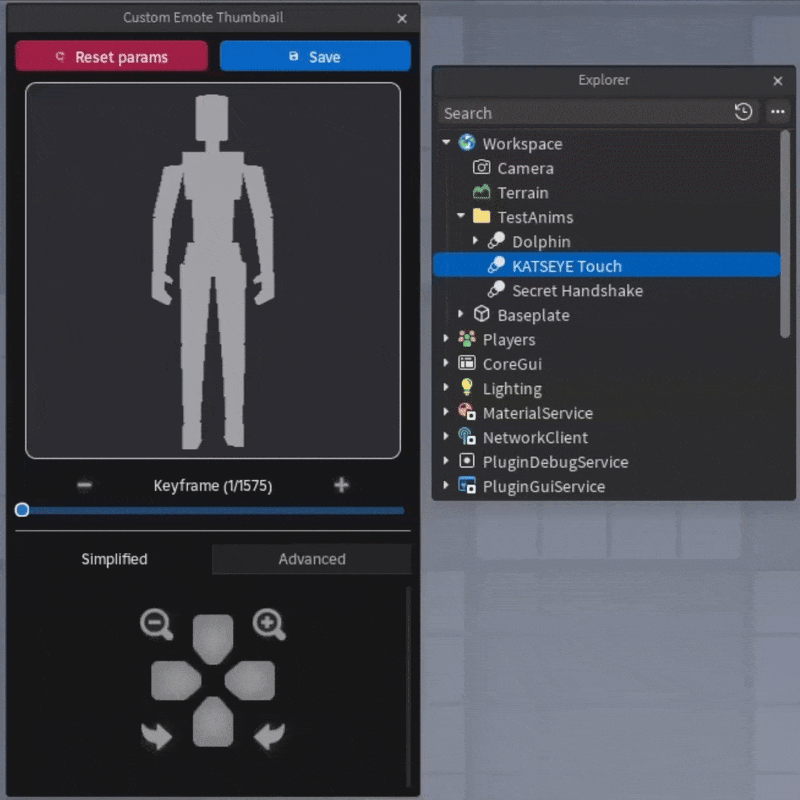

# Emote Custom Thumbnail
Tired of Roblox's automatic emote thumbnails? This plugin gives you full control over every parameter Roblox allows. Switch between a quick, simplified view or dive into advanced mode for pixel-perfect results.

## 📦 Installation
This plugin was made source-available due to Roblox Creator Store requirements (which block the use of `InsertService`).  
To install manually:
1. Download the [**latest release**](https://github.com/Vexot/CustomEmoteThumbnail/releases) from this repository.
2. Place the file in your **Roblox Studio Local Plugins** folder.

<video src="https://github.com/user-attachments/assets/69fe8524-c9f3-4ad2-888a-07cbaba0aa1b">
  Your browser does not support the video tag.
</video>

## ✨ Features
- **Full customization** – tweak every available parameter.
- **Two modes** –  
  - **Simplified Mode**: Fast, intuitive, simplified setup.
  - **Advanced Mode**: Pixel-perfect control.
- **Language sync** – Currently available in **Spanish** and **English**, automatically matching your Studio language.
- Tested to some extent — bug reports and contributions are welcome!

## 🛠 Contributing
Found a bug? Have an idea?  
- Open an **Issue** or send a **Pull Request**.  
- Feel free to suggest improvements or add new features.

## 📚 Notes
- Some functionality comes from **Roblox Client Tracker** due to the lack of official documentation on emote thumbnail customization.  
- This code wasn’t originally meant to be released (it was rushed out before I traveled), so don’t expect perfectly polished code… yet!
